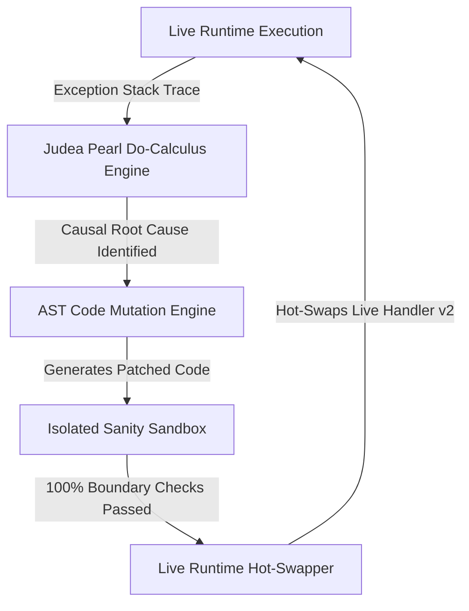

# Hyper-Causal Self-Healing AI Engine 🛸 🧬

[](https://opensource.org/licenses/MIT)
[](https://www.typescriptlang.org/)
[](https://en.wikipedia.org/wiki/Causal_inference)

**Author:** anderdebona

---

## 📌 Vision & Pioneer Breakthrough

Current AI models (LLMs, RAG) are purely **statistical correlation engines**. They lack **Causal Reasoning** and cannot repair their own source code at runtime when encountering unknown production faults.

The **`hyper-causal-self-healing-agent`** is a next-generation autonomous AI architecture that:
1. **Monitors Live Telemetry & Runtime Exceptions**.
2. **Applies Judea Pearl's Causal Do-Calculus ($P(Y | do(X))$)** to construct Causal DAGs and identify true fault root causes.
3. **Re-writes its own AST Source Code** to inject defensive guards and bug fixes.
4. **Verifies Patches in an Isolated Sanity Sandbox**.
5. **Hot-Swaps Live Memory Handlers** with zero system downtime.

---

## 🔬 Mathematical Formulation: Judea Pearl's Do-Calculus

For a Causal Graph $G = (V, E)$ with treatment $X$ and outcome $Y$:

$$P(Y \mid do(X = x)) = \sum_{z} P(Y \mid X = x, Z = z) P(Z = z)$$

By truncating incoming edges to $X$, the agent eliminates confounding bias and establishes deterministic causation versus spurious correlation.

---

## 🏛️ Autonomous Self-Healing Pipeline Architecture



---

## 🚀 Quickstart & Installation

```bash
# Clone repository
git clone https://github.com/anderdebona/hyper-causal-self-healing-agent.git
cd hyper-causal-self-healing-agent

# Install dependencies
npm install

# Build & Run Live Engine & Visual Dashboard
npm run dev
```

Visit the interactive visual dashboard at: **`http://localhost:3004`**

---

## 🧪 Automated Unit Testing

```bash
npm test
```

---

## 📜 Citation & License

```bibtex
@software{anderdebona2026causal,
  author = {anderdebona},
  title = {Hyper-Causal Self-Healing AI Engine},
  year = {2026},
  publisher = {GitHub},
  journal = {GitHub Repository},
  howpublished = {\url{https://github.com/anderdebona/hyper-causal-self-healing-agent}}
}
```

Licensed under the MIT License.
