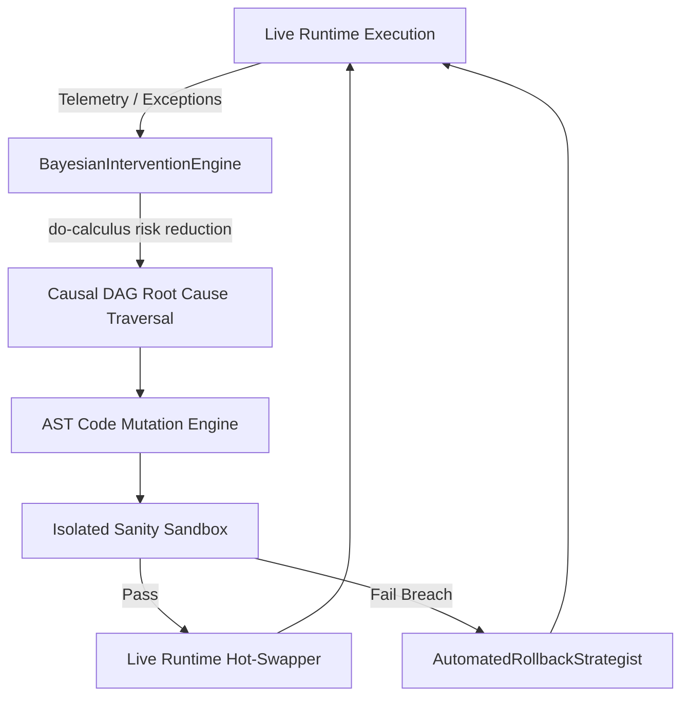

# Hyper-Causal Self-Healing AI Engine 🛸 🧬

<div align="center">

[](https://opensource.org/licenses/MIT)
[](https://www.typescriptlang.org/)
[](https://en.wikipedia.org/wiki/Causal_inference)
[](https://github.com/anderdebona/hyper-causal-self-healing-agent)
[](https://github.com/anderdebona/hyper-causal-self-healing-agent/actions)

<br />

**Pioneering Autonomous AI Engine with Judea Pearl Causal Reasoning (Do-Calculus), Bayesian Interventions & Live AST Self-Healing**

*Engineered by **[anderdebona](https://github.com/anderdebona)***

</div>

---

## 📌 Vision & Pioneer Breakthrough

Current AI models (LLMs, RAG) are purely **statistical correlation engines**. They lack **Causal Reasoning** and cannot repair their own source code at runtime when encountering unknown production faults.

The **`hyper-causal-self-healing-agent`** is a next-generation autonomous AI architecture that:
1. **Monitors Live Telemetry & Runtime Exceptions**.
2. **Applies Judea Pearl's Causal Do-Calculus ($P(Y | do(X))$)** to construct Causal DAGs and evaluate Bayesian interventions.
3. **Re-writes its own AST Source Code** to inject defensive guards and bug fixes.
4. **Verifies Patches in an Isolated Sanity Sandbox** and executes atomic rollbacks with **AutomatedRollbackStrategist**.
5. **Hot-Swaps Live Memory Handlers** with zero system downtime.

---

## 🔬 Mathematical Formulation: Judea Pearl's Do-Calculus

For a Causal Graph $G = (V, E)$ with treatment $X$ and outcome $Y$:

$$P(Y \mid do(X = x)) = \sum_{z} P(Y \mid X = x, Z = z) P(Z = z)$$

By truncating incoming edges to $X$, the agent eliminates confounding bias and establishes deterministic causation versus spurious correlation.

---

## 🏛️ Autonomous Self-Healing Pipeline Architecture



---

## ⚡ What's New in v4.0.0

- 🎲 **`BayesianInterventionEngine`**: Prior and posterior risk modeling under graph $do(X)$ interventions.
- 🔄 **`AutomatedRollbackStrategist`**: Atomic state checkpointing and automatic failure threshold recovery.
- 🧬 **`IncidentTimeline` & `CounterfactualEngine`**: Full incident lifecycle auditing and counterfactual potential outcomes.
- 🐙 **Automated CI/CD Workflows**: Multi-matrix GitHub Actions test and compilation validation.

---

## 🚀 Quickstart & Installation

```bash
# Clone repository
git clone https://github.com/anderdebona/hyper-causal-self-healing-agent.git
cd hyper-causal-self-healing-agent

# Install dependencies
npm install

# Run automated tests
npm test

# Build & Run Live Engine & Visual Dashboard
npm run dev
```

Visit the interactive visual dashboard at: **`http://localhost:3006`**

---

## 🌟 Join the Community & Contribute

We are actively pioneering the frontier of Autonomous Causal Systems:
1. ⭐ **Star this repository** to support self-healing AI research!
2. 🗺️ Check out our roadmap in [ROADMAP.md](./ROADMAP.md).
3. 💬 Propose new causal graphs or mutation patterns via [GitHub Issues](https://github.com/anderdebona/hyper-causal-self-healing-agent/issues).
4. 📜 Academic citation: see [CITATION.cff](./CITATION.cff).

---

<div align="center">

Distributed under the MIT License. Built with passion by **[anderdebona](https://github.com/anderdebona)**.

</div>
